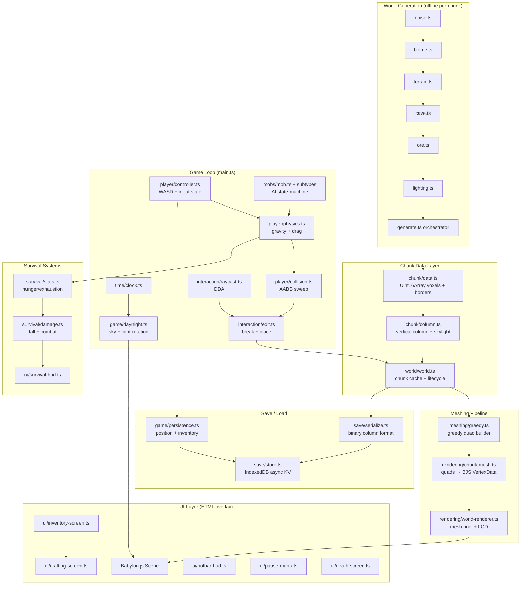

# Architecture

## High-Level System Diagram



---

## Module Descriptions

### `src/rules/`

Single source of truth for all numeric constants and type registries.

| File | Purpose |
|---|---|
| `mc-1.20.ts` | All physics values (gravity 0.08, jump 0.42, drag 0.98), ore tables, hunger/exhaustion costs, tool tiers, smelting times, day length (24000 ticks) |
| `block-registry.ts` | 30+ block types with hardness, transparency, emissive, and drop rules |

### `src/chunk/`

Low-level voxel storage. No game logic, no rendering.

| File | Purpose |
|---|---|
| `data.ts` | `Uint16Array` block storage for one 16x16x16 chunk; includes a 1-voxel neighbor border on all 6 faces to allow cross-chunk face culling without neighbor lookups during meshing |
| `column.ts` | Vertical stack of `ChunkData` objects (one per 16-block Y slice); caches per-column skylight data |

### `src/world/`

Procedural world generation and chunk streaming.

| File | Purpose |
|---|---|
| `noise.ts` | 3D Simplex and Perlin noise implementations |
| `biome.ts` | Classifies a (x, z) column into one of 4 biomes using temperature/rainfall noise |
| `terrain.ts` | Computes base surface elevation per biome, applies biome-specific block layers |
| `cave.ts` | Carves 3D noise-based cave tunnels and air pockets below the surface |
| `ore.ts` | Places 6 ore types at Y-stratified positions with an EC9 air-exposure penalty |
| `lighting.ts` | BFS skylight propagation per chunk column (sky-to-cave flood fill) |
| `generate.ts` | Orchestrates the pipeline: noise → biome → terrain → cave → ore → lighting |
| `world.ts` | Master `World` class: chunk cache, column streaming, block query API |

### `src/meshing/`

Converts raw voxel data into optimized meshes for the GPU.

| File | Purpose |
|---|---|
| `types.ts` | `MeshQuad` and `FaceData` type definitions — the shared interface between generator and consumer; structured for WASM drop-in |
| `greedy.ts` | TypeScript greedy mesher: merges coplanar same-block faces into minimal quads, reducing draw calls dramatically |

**Design note:** The meshing interface is deliberately abstract so a Rust-compiled WASM implementation can replace `greedy.ts` later without touching any other code.

### `src/rendering/`

Babylon.js scene integration.

| File | Purpose |
|---|---|
| `palette.ts` | Maps block IDs to RGB vertex colors (placeholder for PBR textures) |
| `chunk-mesh.ts` | Converts greedy-mesher quad output into a `VertexData` object and applies it to a Babylon.js `Mesh` |
| `world-renderer.ts` | Manages the pool of visible chunk meshes: loads chunks as the player moves, unloads distant chunks, triggers remesh on edits |

### `src/player/`

First-person player movement and physics.

| File | Purpose |
|---|---|
| `physics.ts` | MC-accurate physics: gravity accumulator (0.08/tick), jump impulse (0.42), horizontal drag (0.98), terminal velocity, fall damage calculation |
| `collision.ts` | AABB sweep collision: tests the player bounding box against solid voxels, resolves penetration, tracks `onGround` state |
| `controller.ts` | Wires keyboard/mouse input to physics state; manages pointer-lock camera, angular sensitivity, sprint toggle |

### `src/interaction/`

Block targeting and editing.

| File | Purpose |
|---|---|
| `raycast.ts` | DDA (Digital Differential Analysis) voxel raycast from camera; returns target block position, face normal, and distance |
| `edit.ts` | Break block (removes voxel, spawns drop entity, triggers remesh) and place block (inserts voxel from hotbar, triggers remesh) |

### `src/inventory/`

Item and stack management.

| File | Purpose |
|---|---|
| `stack.ts` | `ItemStack` creation, merging, splitting, tool durability tracking, tool-tier checks |
| `inventory.ts` | 36-slot player inventory (4x9) with hotbar alias; slot operations (pick, place, swap, drop) |

### `src/crafting/`

Recipe definitions and matching engine.

| File | Purpose |
|---|---|
| `recipes.ts` | Recipe definitions (19+ shaped and shapeless recipes covering the core material tree) |
| `craft.ts` | Shaped matching (with rotation), shapeless matching (multiset comparison), output stack generation |

### `src/mobs/`

Mob base class and all mob type implementations.

| File | Purpose |
|---|---|
| `mob.ts` | Base class: health, AI state machine, physics integration, loot tables |
| `*.ts` (subtypes) | Cow, pig, chicken, sheep (passive); zombie, creeper, skeleton, spider (hostile) — each overrides AI behavior and loot |

### `src/rendering/` (audio + effects share the rendering pass)

### `src/audio/`

| File | Purpose |
|---|---|
| `manager.ts` | `AudioContext` lifecycle management, mixer channels (master/music/sfx) |
| `sampler.ts` | Positional sound playback for block and mob events |

### `src/effects/`

| File | Purpose |
|---|---|
| `particles.ts` | Block-break burst particle burst, floating damage number indicators |
| `manager.ts` | Particle spawn queue, per-frame update and frustum-cull loop |

### `src/ui/`

HTML overlay HUD (all rendered as DOM elements over the WebGL canvas).

| File | Purpose |
|---|---|
| `hotbar-hud.ts` | 9-slot hotbar with selection highlight and stack count badges |
| `survival-hud.ts` | Health hearts, hunger drumsticks, day counter, status effect icons |
| `inventory-screen.ts` | Full inventory modal with drag-and-drop slot grid |
| `crafting-screen.ts` | Workbench (3x3) and furnace modals with recipe auto-detection |
| `death-screen.ts` | Death overlay with respawn button |
| `pause-menu.ts` | Pause overlay with save, load, settings, and quit actions |
| `modal.ts` | Shared modal container abstraction (open/close, pointer-lock release) |
| `icon-renderer.ts` | Block sprite renderer for inventory slot icons |
| `hud.css` | All CSS custom properties (colors, spacing, font sizes) — design system root |

### `src/game/`

| File | Purpose |
|---|---|
| `daynight.ts` | Applies sky colors and directional light angle to the Babylon.js scene each tick |
| `persistence.ts` | Coordinates save/load of player state (position, view angles, inventory) |

### `src/time/`

| File | Purpose |
|---|---|
| `clock.ts` | Deterministic 24000-tick day counter; converts tick to time-of-day phase |
| `sky.ts` | Interpolates sky RGB and ambient light intensity by time of day (sunrise warmth, noon blue, sunset orange, midnight dark) |

### `src/sleep/`

| File | Purpose |
|---|---|
| `bed.ts` | Sleep eligibility check (night only, no nearby hostiles), spawn-point setting, clock advance to dawn |

### `src/survival/`

| File | Purpose |
|---|---|
| `stats.ts` | Hunger, saturation, exhaustion economy; sprint/jump exhaustion costs, starvation damage, natural regeneration |
| `damage.ts` | Fall damage (height above 3 blocks), combat damage pipeline, potion effect application |

### `src/save/`

| File | Purpose |
|---|---|
| `serialize.ts` | Binary serialization of `ChunkColumn` to `Uint8Array` (run-length encoded voxels + skylight) |
| `store.ts` | `IndexedDbStore` — async key-value store backed by IndexedDB; in-memory fallback for dev/test |

---

## Data Flow: World Generation to Rendered Mesh

```
Player moves into new chunk area
    ↓
world.ts requests ChunkColumn (cache miss)
    ↓
generate.ts orchestrates pipeline:
  noise.ts → biome.ts → terrain.ts → cave.ts → ore.ts → lighting.ts
    ↓
ChunkColumn stored in world cache (Uint16Array blocks + skylight)
    ↓
world-renderer.ts detects new visible column
    ↓
greedy.ts reads chunk block data + neighbor borders
  → builds list of MeshQuad (position, size, face, blockId)
    ↓
chunk-mesh.ts converts quads → BJS VertexData
  (positions, normals, indices, vertex colors from palette.ts)
    ↓
Babylon.js uploads VertexData to GPU
    ↓
Scene renders at 60fps
```

---

## Game Loop

Each animation frame (`engine.runRenderLoop`):

```
1. clock.ts tick()                       — advance day counter
2. daynight.ts apply()                   — update sky color + sun angle
3. player/controller.ts tick()           — read input, build movement vector
4. player/physics.ts tick()              — apply gravity, drag, jump
5. player/collision.ts sweep()           — resolve voxel AABB collisions
6. survival/stats.ts tick()              — drain hunger, apply exhaustion, regen health
7. survival/damage.ts tick()             — apply ongoing effects (fall landing, poison)
8. mobs/*.ts tick() (each mob)           — AI state transitions, pathfinding, physics
9. effects/manager.ts tick()             — update + cull particles
10. world-renderer.ts tick()             — load/unload chunks based on player position
11. scene.render()                       — Babylon.js renders the frame
12. UI HUD update()                      — sync hotbar, health, hunger DOM state
```

---

## Save System

```
Trigger: F5 key or pause menu "Save"
    ↓
game/persistence.ts saves player state:
  { position, yaw, pitch, inventory } → JSON → IndexedDB key "player"
    ↓
world.ts iterates dirty chunks:
  serialize.ts encodes ChunkColumn → Uint8Array (RLE blocks + skylight)
  store.ts writes ArrayBuffer → IndexedDB key "chunk:X:Z"
    ↓
All writes are async; a "Saved" toast confirms completion

Load (on game start or manual load):
  store.ts reads all "chunk:*" keys → serialize.ts decodes → world cache
  store.ts reads "player" key → JSON.parse → player position + inventory
```

---

## Key Design Decisions

### Greedy Meshing

Naive meshing emits one quad per visible block face — O(N) quads where N is visible faces. Greedy meshing merges coplanar, same-block faces into maximal rectangles, reducing quad count by 10-100x in typical terrain. This is the primary draw-call optimization.

The mesher is isolated behind the `MeshQuad`/`FaceData` interface in `src/meshing/types.ts` to allow a future Rust-compiled WASM replacement without changing any consuming code.

### Procedural Vertex Colors

Rather than a texture atlas (which requires UV layout and a texture upload), blocks are colored using per-vertex RGB values sampled from `src/rendering/palette.ts`. This eliminates texture memory pressure and avoids UV seam artifacts at chunk borders. A PBR material layer can be added later without changing the meshing pipeline.

### 1-Voxel Neighbor Borders in ChunkData

Each `ChunkData` stores a 1-voxel-wide border of neighboring chunk data (18x18x18 total vs 16x16x16 logical). This allows the greedy mesher to determine face visibility at chunk boundaries without querying the `World` class during meshing, keeping meshing pure and parallelizable.

### MC 1.20 Constants as Single Source of Truth

All numeric game values (physics, hunger costs, ore frequencies, tool damage, day length) live in `src/rules/mc-1.20.ts`. This prevents drift between systems and makes balancing changes atomic. No magic numbers appear elsewhere in the codebase.

### COOP/COEP Headers

The Vite dev and preview servers inject:
- `Cross-Origin-Opener-Policy: same-origin`
- `Cross-Origin-Embedder-Policy: require-corp`

These enable cross-origin isolation, which is required for `SharedArrayBuffer` access (used by WASM workers) and prevents Spectre/Meltdown side-channel attacks via timing APIs.
